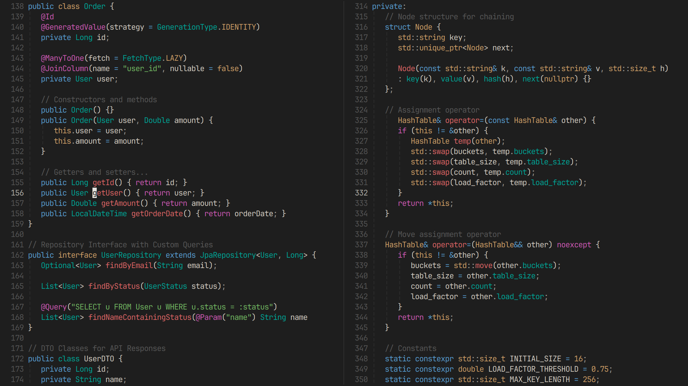
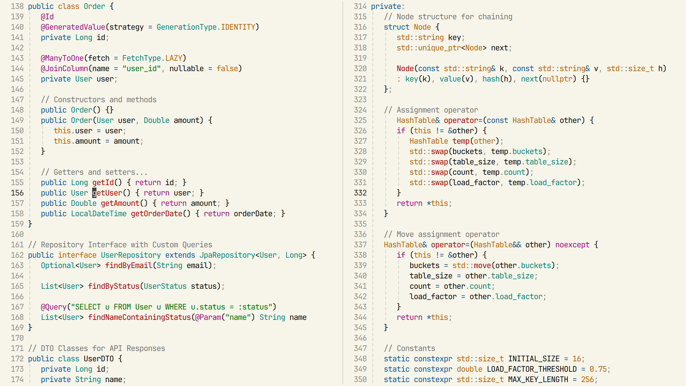

# shibumi.nvim

渋み · _Simple and unobtrusive by design_




## Installation

Using [vim.pack](https://neovim.io/doc/user/helptag.html?tag=vim.pack):

```lua
vim.pack.add({
   { src = "https://github.com/darianmorat/shibumi.nvim" }
})

```

Using [lazy.nvim](https://github.com/folke/lazy.nvim):

```lua
{
   "darianmorat/shibumi.nvim",
   lazy = false,
   priority = 1000,
   opts = {},
}
```

## Usage

Enable the colorscheme:

```lua
vim.cmd.colorscheme("shibumi")
-- or
vim.cmd.colorscheme("shibumi-light")
```

## Configuration

Some additional settings:

```lua
opts = {
   transparent = false, -- Show or hide background
   colors = {}, -- Override default colors
   highlights = {}, -- Override highlight groups
},
```

## Contributing

Pull requests are welcome!  
Bug reports and feature suggestions can also be submitted via [Issues](../../issues)
